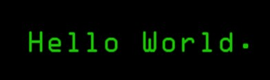

<!--  -->

## I'm Adhith Sankar - aka [CodeSavitar] 👋

### I'm a B-Tech CSE third year student at SRMIST KTR!!

- 👨🏾‍💻 ML and Computer Vision developer
- 🙋🏾‍♂️ Pronouns : He/His
- 👀 I’m interested in learning new things :)
- 🌱 I’m currently learning Django
- ⭐ I’m looking to collaborate on Data Science/AI projects
- 🥅 2021 Goals: Contribute more to Open Source projects and also win a Hackathon ⚡
- ⚡ Fun fact: I love listening to music while I code 🎶
### Connect with me 😄:

[][linkedin]
[][instagram]
[][stackoverflow]

 
 

### My Github Stats 😅:

 

    

 

    

 
 

<!--  -->

[linkedin]: https://www.linkedin.com/in/adhith-sankar-481825156/
[instagram]: https://www.instagram.com/aadhi_sagit/
[stackoverflow]: https://stackoverflow.com/users/15374084/codesavitar
